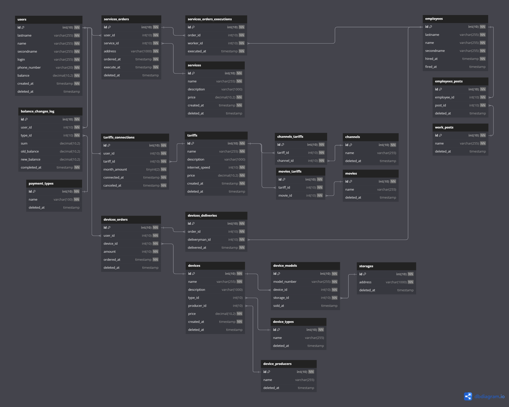

# База данных компании "Город электронный"

## Структура БД

База данных размещена в 22 таблицах и выстроена следующим образом:

[Ссылка][schema] на схему БД в приложении. [Реализация](dumps/city_electricity.sql) БД на MySQL.

Центральной таблицей является таблица users. Она содержит информацию о клиентах компании и её первичный ключ используется как индекс во многих других таблицах.

Похожей является таблица employees, в которой хранится информация о сотрудниках компании, а таблица work_posts хранит должности в компании. Связь типа многие-ко-многим между ними реализовывается через вспомогательную таблицу employees_posts.

Таблица balance_changes_log используется для хранения истории пополнения и списания средств с баланса каждого пользователя.

Таблицы-каталоги services, tariffs и devices хранят данные о услугах, тарифах и продаваемых устройствах соответственно. Таблицы movies и channels, хранящие списки фильмов и каналов, связаны с таблицей тарифов связью многие-ко-многим. У таблицы устройств также есть вспомогательные таблицы: device_models (конкретные хранимые на складах устройства), device_types (типы устройств), device_producers (производители устройств).

В свою очередь таблицы services_orders, tariffs_connections, devices_orders соотвествуют таблицам-каталогам. В них хранятся данные о покупках клиентами тех или иных услуг.

## Типовые данные

В файле [typical_data.sql](dumps/typical_data.sql) находятся типовые данные для каждой из таблиц. 

## Представления

## Процедуры 

[schema]: https://www.dbdiagram.io/d/Gorod-elektronnyj-665ac6ecb65d9338793b1721
